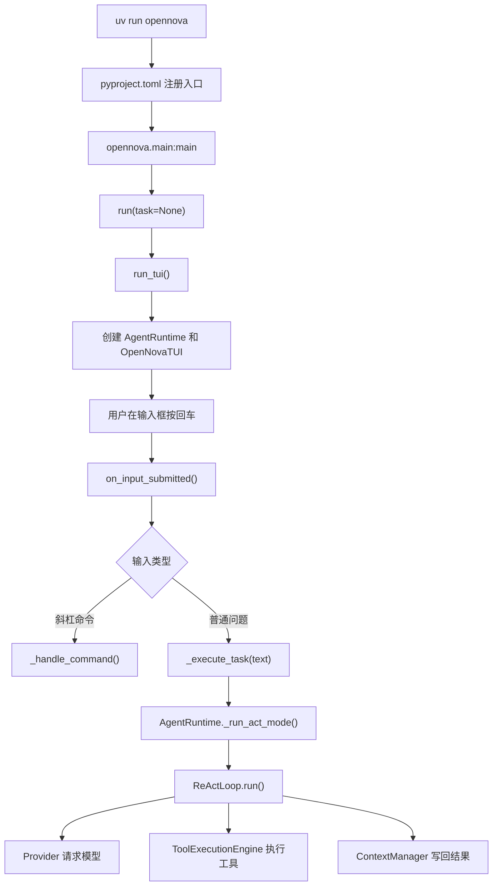
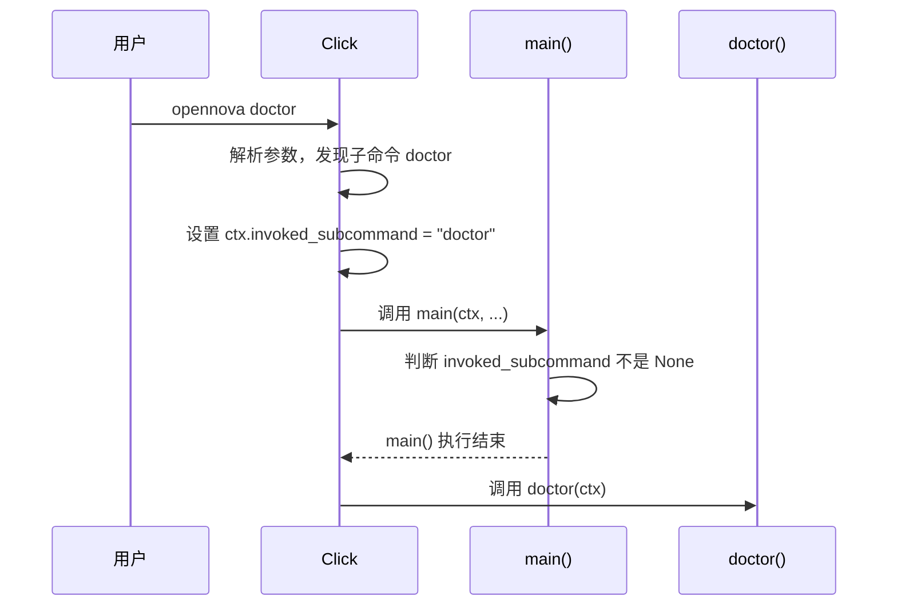
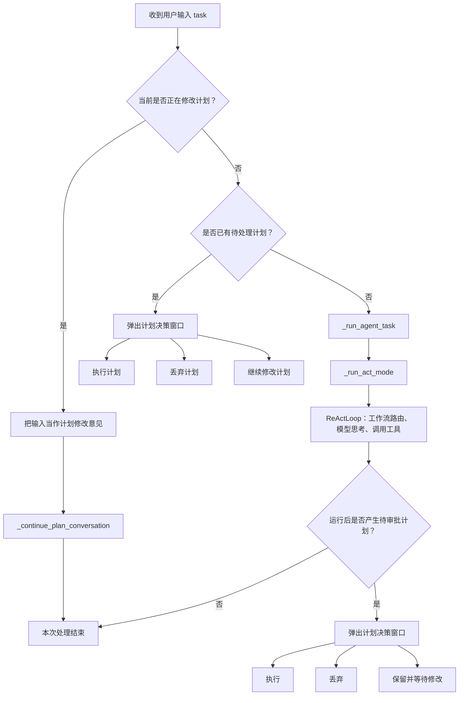
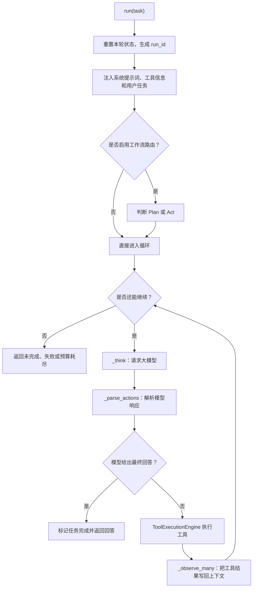

## 阅读顺序

1. 启动入口与问题提交
2. `AgentRuntime` 如何组装整个 Agent
3. `ReActLoop` 如何循环调用模型和工具
4. Provider 如何请求 OpenAI、Anthropic、DeepSeek
5. 工具如何注册、校验和执行
6. 上下文、记忆与压缩
7. 会话保存、恢复与状态机
8. Plan、安全策略、Skill、MCP、插件和子 Agent

## 启动方式

### 不带子命令

`uv run opennova`：没有子任务，

- `main.py → main函数 → run函数 → run_tui函数` 

- 创建`AgentRuntime`和`OpenNovaTUI`，启动 TUI。

`run_tui函数`：创建 Agent 和界面

```python
agent = AgentRuntime(config) # AgentRuntime 是后端，管理模型、工具、上下文、会话和状态。
app = OpenNovaTUI(agent, config, ...) # OpenNovaTUI 是前端，管理输入框、消息区和各种面板。
await app.run_async()
```

### 带子命令

`uv run opennova run "问题"`：有子任务，

- `main.py → main函数（运行结束）` ， 子命令run通过Click触发 `run函数 → _run_single_task函数` 

- 走一次性任务 `_run_single_task()`。

“子命令”是 `opennova` 后面不以 `-` 开头、用于选择具体功能的单词。

下面的 `run`、`plan`、`list-tools`、`doctor`、`config`、`init` 都是子命令。

```
uv run opennova run "读取 README.md"
uv run opennova plan "重构登录模块"
uv run opennova list-tools
uv run opennova doctor
uv run opennova config
uv run opennova init
```

下面的`--resume`、`--continue`、`--permission-mode` 以 `--` 开头，它们是“选项”，不是子命令。

```
uv run opennova
uv run opennova --resume
uv run opennova --continue
uv run opennova --permission-mode full
```


## 启动流程

### 启动流程逻辑

执行 `uv run opennova` 

完整顺序是：

```
→ uv
→ 在项目虚拟环境中找到 opennova 命令
→ 根据 pyproject.toml 找到 opennova.main:main
→ 调用 main
→ Click 接管参数解析和命令分发
```

关键配置在 `pyproject.toml (line 45)` ：

```
[project.scripts]
opennova = "opennova.main:main"
```

`main.py` 的 `main` 上有 `@click` 装饰器，`Click` 接管该函数：

```python
@click.group(invoke_without_command=True)
def main(...):
    ...
```

实际首先进入的是 Click 的处理流程：

```
调用 main()
    → Click 读取 sys.argv
    → 解析顶层选项
    → 判断有没有子命令
    → 创建 Context
    → 设置 ctx.invoked_subcommand
    → 调用原来的 main 函数
    → 必要时继续调用子命令函数
```

当启动命令没有子命令时：

```
调用main.py的run()
	→ 执行run_tui()
	→ 创建 AgentRuntime 和 OpenNovaTUI，并启动 Textual 事件循环
	→ 用户在输入框按回车后，Textual 产生 Input.Submitted 事件，进入on_input_submitted() (cli/tui.py line 1389)
```

`cli/tui.py on_input_submitted()` 逻辑：

```
→ 取出输入框文本。
→ 过滤空文本和短时间内的重复提交。
→ 判断是否正在回答 ask_user_question。
→ 判断 Agent 是否已经在运行。
→ 清空输入框，把用户消息显示到消息区。
→ 分辨斜杠命令和普通问题。
→ 最终走到：self._launch_agent_task(self._execute_task(text))
```

`cli/tui.py _execute_task` 逻辑：

```python
# 前半部分处理“当前是否存在待审批计划”。
# 没有计划时，核心代码是：问题交给 AgentRuntime
await self._run_agent_task(
    self.agent._run_act_mode(
        task=task,
        stream=True,
        preserve_context=preserve_context,
        route_workflow=route_workflow,
    )
)
```

### 启动流程图



### uv run opennova doctor命令流程案例



## tui.py _execute_task()逻辑

可以把 `_execute_task()` 理解成一个“任务分流器”。它本身不会分析任务怎么实现，也不会直接调用大模型；它主要根据当前是否存在计划，决定把用户输入送到哪个执行流程。



## runtime/loop.py ReActLoop.run()逻辑

简单说，`ReActLoop.run()` 就是 Agent 的核心循环：

```
Reason：让大模型根据当前上下文思考
Act：解析模型要求调用的工具并执行
Observe：把工具结果写回上下文
然后再次 Reason
```

直到模型不再调用工具、给出最终回答，或者达到迭代次数、预算、错误次数、取消等终止条件。



## `uv tool install .` 原理

### 基本原理

> 把当前项目“构建成可安装包”，安装到一个独立的 Python 环境中，再把项目声明的命令启动器放进系统 `PATH` 可搜索的目录。

你当前机器上的实际结构是：

```
工具环境：
C:\Users\Administrator\AppData\Roaming\uv\tools\opennova

命令启动器：
C:\Users\Administrator\.local\bin\opennova.exe
```

执行 `where opennova` 得到：

```
C:\Users\Administrator\.local\bin\opennova.exe
```

完整安装过程如下：

```
在 OpenNova 仓库执行 uv tool install .
        ↓
uv 读取当前目录的 pyproject.toml
        ↓
识别项目名称 opennova 和依赖
        ↓
创建独立工具环境
AppData\Roaming\uv\tools\opennova
        ↓
把 OpenNova 及其依赖安装到该环境
        ↓
读取 [project.scripts]
opennova = "opennova.main:main"
        ↓
生成 opennova.exe 启动器
        ↓
把启动器放到 C:\Users\Administrator\.local\bin
        ↓
该目录已经加入 PATH
```

之后在任意目录执行：

```
opennova
```

PowerShell 会按照 `PATH` 中的目录顺序查找可执行文件：

```
当前目录有没有 opennova.exe？
        ↓ 没有
依次检查 PATH 中的目录
        ↓
在 C:\Users\Administrator\.local\bin 找到 opennova.exe
        ↓
启动 uv 管理的独立工具环境
        ↓
导入 opennova.main
        ↓
调用 main
        ↓
Click 接管命令解析
        ↓
没有子命令，启动 TUI
```

这里的关键配置还是 [pyproject.toml (line 45)](C:/python_projects/opencode/pyproject.toml:45)：

```
[project.scripts]
opennova = "opennova.main:main"
```

如果没有这段配置，uv 虽然可以安装 Python 包，但不知道要暴露一个名为 `opennova` 的终端命令。

还有一个对学习和调试很重要的区别：

| 命令              | 使用的环境         | 源码修改是否立即生效                  |
| ----------------- | ------------------ | ------------------------------------- |
| `uv run opennova` | 当前项目的 `.venv` | 通常立即使用当前工作区代码            |
| `opennova`        | uv 的独立工具环境  | 使用上次 `uv tool install` 安装的版本 |

因此你修改仓库代码后：

```
uv run opennova
```

适合开发调试。

### 源代码变动

直接执行：

```
opennova
```

可能还是之前安装的版本。需要重新安装才能更新：

```
uv tool install --force .
```

最后还有一个容易忽略的点：虽然 `opennova.exe` 安装在固定位置，但程序的当前工作目录仍是你执行命令时所在的目录。

例如：

```
cd C:\my-project
opennova
```

OpenNova 中的：

```
Path.cwd()
```

得到的是：

```
C:\my-project
```

所以它会把 `C:\my-project` 当成当前项目进行文件读取、会话保存、安全检查和工具操作。换句话说，安装位置决定“程序从哪里启动”，当前目录决定“Agent 操作哪个项目”。